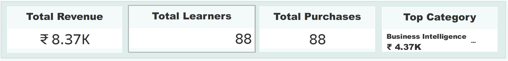
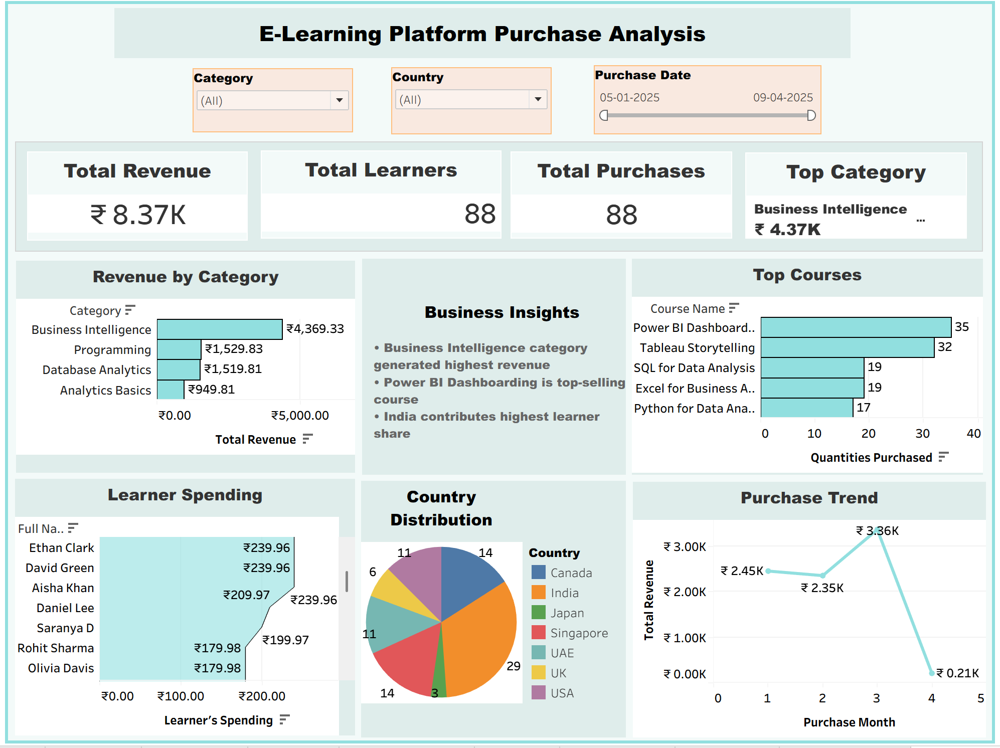
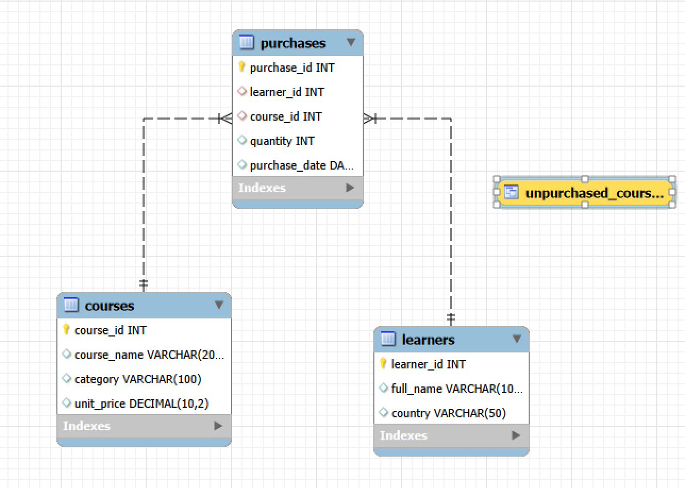

# E-Learning Platform Revenue & Learner Behavior Analysis using MySQL and Tableau

## Project Overview

This project analyzes learner purchases and revenue trends for an online e-learning platform using MySQL and Tableau. The objective of the project was to understand learner spending behavior, identify high-performing courses and categories, analyze regional learner distribution, and generate business insights to support strategic decision-making.

The project combines relational database design, analytical SQL querying, and interactive business intelligence dashboarding to simulate a real-world analytics workflow.

---

# Business Problem

E-learning platforms require data-driven insights to understand:

* Which courses generate the highest revenue
* Which categories drive learner engagement
* Which learners contribute the highest spending
* Which regions have the strongest learner base
* Which courses require performance improvement

Without analytical reporting, business teams may struggle to optimize pricing strategies, learner targeting, and marketing campaigns.

---

# Project Objectives

* Analyze learner purchase behavior
* Calculate learner-wise spending
* Identify top-selling courses
* Evaluate category-wise revenue performance
* Analyze multi-category learner behavior
* Detect underperforming courses
* Build an interactive Tableau dashboard
* Generate business recommendations using SQL-driven insights

---

# Tools & Technologies Used

| Tool            | Purpose                                 |
| --------------- | --------------------------------------- |
| MySQL           | Database creation and SQL analysis      |
| MySQL Workbench | Query execution and relational modeling |
| Tableau         | Dashboard creation and visualization    |
| SQL             | Data analysis and KPI generation        |

---

# Database Design

The project uses a relational database schema consisting of:

## Tables

* Learners
* Courses
* Purchases

The purchases table acts as the transactional fact table, while learners and courses act as dimension tables linked through foreign key relationships.

---

# Dataset Overview

| Dataset Metric        | Value            |
| --------------------- | ---------------- |
| Learners              | 88               |
| Courses               | 6                |
| Purchase Transactions | 88+              |
| Countries             | Multiple Regions |

---

# SQL Concepts Implemented

The project demonstrates the following SQL concepts:

* INNER JOIN
* LEFT JOIN
* RIGHT JOIN
* GROUP BY
* HAVING
* ORDER BY
* LIMIT
* Aggregate Functions
* Common Table Expressions (CTE)
* Window Functions
* DENSE_RANK()
* SQL Views
* Multi-Table Relational Analysis
* Business Performance Analytics

---

# Key Business Questions

* Which learners contribute the highest spending?
* Which courses generate the highest demand?
* Which categories generate maximum revenue?
* Which learners purchase across multiple categories?
* Which courses are underperforming?
* Which countries contribute the largest learner base?
* How do monthly revenue trends fluctuate over time?

---

# Tableau Dashboard Features

The Tableau dashboard includes:

* KPI cards for revenue, learners, and purchases
* Revenue contribution by category
* Top-selling course analysis
* Country-wise learner distribution
* Monthly revenue trend analysis
* Interactive dashboard filters

---

# Key Insights

## 1. Business Intelligence Dominates Platform Revenue

The Business Intelligence category generated the highest platform revenue, contributing more than 50% of total platform revenue.

## 2. Power BI Dashboarding is the Top-Selling Course

Power BI Dashboarding recorded the highest number of purchases, followed closely by Tableau Storytelling.

## 3. India Represents the Largest Learner Base

India contributed the highest learner share among all countries, indicating strong market potential for analytics-focused learning.

## 4. Revenue Concentration Exists Across Few Categories

Business Intelligence and Programming categories contributed the majority of platform revenue, while Analytics Basics generated comparatively lower revenue.

## 5. Revenue Peaked in Month 3

Platform revenue increased steadily before declining significantly in Month 4, indicating changing learner engagement trends.

## 6. High-Spending Learners Contribute Significantly

A small segment of learners contributed disproportionately higher spending, creating opportunities for premium upselling strategies.

---

# Business Recommendations

## Expand High-Performing BI Courses

* Introduce advanced BI learning tracks
* Add certification-oriented programs
* Launch real-world dashboard projects

## Strengthen Low-Revenue Categories

* Optimize pricing strategies
* Improve course visibility
* Create beginner-friendly bundles

## Focus Marketing on India

* Run region-specific campaigns
* Improve localized promotions
* Target analytics learner communities

## Introduce Structured Learning Paths

Bundle:

* SQL
* Excel
* Power BI
* Python

into complete analyst career tracks.

## Improve Revenue Stability

* Launch recurring promotional campaigns
* Improve learner engagement communication
* Introduce subscription-based learning plans

---

# Repository Structure

```text
elearning-platform-sql-analysis/
│
├── README.md
│
├── sql/
│   └── elearning_mysql_assignment.sql
│
├── report/
│   └── E-Learning-Platform-Analysis-Report.pdf
│
├── dashboard/
│   └── Tableau_Dashboard.twbx
│
├── screenshots/
│   ├── dashboard.png
│   ├── kpi_cards.png
│   └── eer_diagram.png
```

---

# Screenshots

## KPI Dashboard



## Full Tableau Dashboard



## EER Diagram

<div align="center">
  
</div>

---

# Future Improvements

* Real-time sales tracking
* Predictive purchase forecasting
* Learner retention analysis
* Cohort analysis
* Personalized course recommendation system

---

# Conclusion

This project demonstrates how MySQL and Tableau can be combined to perform end-to-end business intelligence analysis for an e-learning platform. The project highlights the role of SQL-driven analytics, relational database design, and dashboard visualization in supporting business decision-making and revenue optimization.

---

# Author

Saranya D
Aspiring Data Analyst

## Tags

`MySQL` `Tableau` `SQL` `Data Analytics` `Business Intelligence` `Dashboard` `Data Visualization` `CTE` `Window Functions` `DENSE_RANK` `SQL Views` `Relational Database` `KPI Analysis` `Revenue Analysis` `Learner Behavior Analysis` `E-Learning Analytics` `MySQL Workbench` `Business Reporting` `Analytical SQL` `Portfolio Project`
